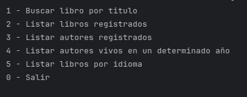

# LITERALURA - CHALLENGUE JAVA

Este proyecto permite buscar información sobre libros mediante una API externa y almacenarla en una base de datos. Permite además listar libros registrados y consultar información de autores de acuerdo con filtros específicos. Desarrollado como parte del aprendizaje en Java y Spring Boot para un desafío propuesto por Alura Latam y Oracle; este proyecto también pone en práctica el uso de APIs REST y bases de datos.

## Características

- Búsqueda dinámica de libros por título mediante la API de Gutendex.
- Almacena información de libros y autores en una base de datos.
- Permite listar todos los libros registrados y autores únicos.
- Consulta de autores que estaban vivos en un año determinado.
- Incluye soporte para las siguientes funcionalidades:
  - Buscar y guardar un libro en la base de datos PostgreSQL.
  - Listar libros registrados en DB.
  - Listar autores registrados en DB.
  - Filtrar autores vivos en un año específico en DB.

## Tecnologías Utilizadas

- Lenguaje de programación: Java
- Framework: Spring Boot
- Base de datos: PostgreSQL
- Librerías utilizadas:
  - Spring Data JPA para persistencia de datos.
  - RestTemplate para consumo de API externa.
  - Jackson para manejo de JSON.
  - Gutendex API para obtener información de libros en tiempo real.

## Uso

1. Clona el repositorio.
2. Asegúrate de tener configurado tu entorno de Java (JDK 11 o superior) y PostgreSQL.
3. Configura las variables de conexión a la base de datos en `application.properties`.
4. Ejecuta el archivo principal `BackFraseAleatoriaApplication.java`.
5. Navega a través del menú interactivo de la consola para seleccionar las opciones de búsqueda y consulta de información.

## Autor

- Juan Valenzuela
- [GitHub](https://github.com/Juan-Valenzuela3)
- [LinkedIn](https://www.linkedin.com/in/juan-valenzuela-camelo)

## Licencia

- Este proyecto está licenciado bajo la [Licencia MIT](./LICENSE).

## Interfaz

